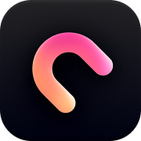

<div align="center">
  <a href="https://notcms.com">
    <picture>
      
    </picture>
  </a>
  <h1>NotCMS</h1>

  <a href="https://notcms.com">
    ウェブサイト
  </a> ·
  <a href="https://dash.notcms.com">
    ダッシュボード
  </a> ·
  <a href="https://notcms.com/templates">
    テンプレート
  </a> ·
  <a href="https://notcms.com/blog">
    ブログ
  </a>

NotCMS は、Notion を使った CMS の構築を簡単にします。Notion データベースをコンテンツの保存先として扱うための、型安全な TypeScript SDK を提供します。

[![npm package][npm-img]][npm-url]
[![Downloads][downloads-img]][downloads-url]
[![Issues][issues-img]][issues-url]
[![DeepWiki][deepwiki-img]][deepwiki-url]

</div>

[English](README.md) | [日本語](README.ja.md)

## 主な機能

- 🛡️ **型安全**: TypeScript による、クエリとレスポンスの型付け
- 🎯 **シンプルな API**: コンテンツを取得するための分かりやすい API
- 📝 **Notion をバックエンドに**: Notion の使いやすいエディターでコンテンツを作成
- 🔄 **フレームワークに依存しない**: Next.js、React、Vue など、さまざまな JavaScript フレームワークで利用可能
- 🛠️ **CLI ツール**: プロジェクトのセットアップ、ブラウザーログイン、スキーマ管理に使う NotCMS CLI を同梱

## はじめに

### インストール

```bash
npm install notcms
```

CLI は `notcms` に含まれるため、別の CLI パッケージは不要です。非推奨の `npx notcms-kit <command>` は `npx notcms <command>` に置き換えてください。

### 使い方

#### 1. プロジェクトの初期化

npx で CLI を直接実行します。

```bash
npx notcms init
```

`notcms.config.json` が作成されます。認証情報がない場合はブラウザーでログイン画面が開き、`NOTCMS_SECRET_KEY` と `NOTCMS_WORKSPACE_ID` が `.env.local` に保存されます。

`notcms` がプロジェクトの直接依存として登録され、利用可能な状態になっていることも確認します。検出したパッケージマネージャーのインストールまたは追加コマンドを提示し、既存の依存バージョン指定は置き換えません。その後、スキーマを取得し、実行できる最初のクエリ例を表示します。

#### 2. スキーマの更新

Notion データベースのスキーマが変わったら、pull コマンドを実行します。

```bash
npx notcms pull
```

NotCMS からデータベースのスキーマを取得し、設定した TypeScript ファイルを再生成します。

生成されるスキーマの例は次のとおりです。

```ts
// src/notcms/schema.ts
import { Client } from "notcms";
import type { Schema } from "notcms";

export const schema = {
  blog: {
    id: "your_notion_database_id",
    properties: {
      title: "title",
      description: "rich_text",
      published: "checkbox",
      thumbnails: "files",
      // プロパティを更新したら notcms pull を再実行してください
    },
  },
} satisfies Schema;

export const nc = new Client({ schema });
```

#### 3. コンテンツの取得

```ts
import { nc } from "./notcms/schema";

// ブログ記事の一覧を取得
const [pages] = await nc.query.blog.list();

// 特定のブログ記事を取得
const [page] = await nc.query.blog.get("page_id");

// エラーへの対応
const [data, error] = await nc.query.blog.list();
if (error) {
  console.error("Failed to fetch blog posts:", error);
}
```

### 従来の CLI・SDK からのアップグレード

SDK と CLI は `notcms` にまとめて提供されています。古い依存バージョンの指定は明示的に更新してください。`init` は既存 SDK のバージョン指定を保持し、自動でアップグレードしません。

```bash
npm uninstall notcms-kit # プロジェクトの依存関係に含まれる場合のみ
npm install notcms@latest
npx notcms pull
npx notcms pull --check
```

`notcms.config.json` とサーバー側の認証情報は保持してください。古い `notcms-kit init` / `notcms-kit pull` のスクリプトは `notcms init` / `notcms pull` に置き換えます。

アップグレードをデプロイする前に、スキーマを再生成し、アプリケーションの型検査を実行してください。`0.0.12-development` などのプレリリース版 SDK から更新する場合は特に必要です。パッケージマネージャーごとのコマンド、CI での利用方法、互換性の確認については、[移行チェックリスト](docs/ja/cli-commands/migration.mdx)を参照してください。

## サンプルとテンプレート

次のサンプルを参考に、すぐに使い始められます。

- ブログやリリースノート向けの[公開状態・言語・安定した URL の実装例](examples/content-recipes/README.md)
- 📚 [Next.js シンプルブログのテンプレート](https://github.com/qqpann/notcms/tree/main/examples/nextjs-simple-blog-template)
- 🎨 [ウェブサイトで公開しているその他のテンプレート](https://notcms.com/templates)

実行可能なサンプルのソースは [`examples/`](examples/) にあります。

## トラブルシューティング

### 認証エラー

「secretKey is required」や「workspaceId is required」というエラーが表示されたら、次の点を確認してください。

1. 環境変数が正しく設定されていること
2. 変数名が正しいこと（`NOTCMS_SECRET_KEY` と `NOTCMS_WORKSPACE_ID`）
3. 環境変数が正しく読み込まれていること

### スキーマエラー

スキーマに関するエラーが発生したら、次の点を確認してください。

1. Notion データベースの ID が正しいこと
2. プロパティの型が Notion データベースの設定と一致していること
3. `npx notcms pull` を実行してスキーマを再生成すること

## コントリビューション

貢献を歓迎します。詳しくは[コントリビューションガイド](CONTRIBUTING.md)を参照してください。

**補足**: このプロジェクトはバージョン管理に [Changesets](https://github.com/changesets/changesets) を使用しています。リリース対象の変更を行う場合は、`pnpm changeset` を実行し、変更内容を説明する changeset を作成してください。

## ライセンス

このプロジェクトは、複数のパッケージを含むモノレポです。

- `packages/notcms`: [MIT ライセンス](packages/notcms/LICENSE)
- `packages/notcms-kit`（非推奨）: [MIT ライセンス](packages/notcms-kit/LICENSE)
- `examples/nextjs-simple-blog-template`: [MIT ライセンス](examples/nextjs-simple-blog-template/LICENSE)

詳細は各ディレクトリのライセンスを参照してください。

<!-- -->

[build-img]: https://github.com/qqpann/notcms/actions/workflows/release.yml/badge.svg
[build-url]: https://github.com/qqpann/notcms/actions/workflows/release.yml
[downloads-img]: https://img.shields.io/npm/dt/notcms
[downloads-url]: https://www.npmtrends.com/notcms
[npm-img]: https://img.shields.io/npm/v/notcms
[npm-url]: https://www.npmjs.com/package/notcms
[issues-img]: https://img.shields.io/github/issues/qqpann/notcms
[issues-url]: https://github.com/qqpann/notcms/issues
[codecov-img]: https://codecov.io/gh/qqpann/notcms/branch/main/graph/badge.svg
[codecov-url]: https://codecov.io/gh/qqpann/notcms
[semantic-release-img]: https://img.shields.io/badge/%20%20%F0%9F%93%A6%F0%9F%9A%80-semantic--release-e10079.svg
[semantic-release-url]: https://github.com/semantic-release/semantic-release
[commitizen-img]: https://img.shields.io/badge/commitizen-friendly-brightgreen.svg
[commitizen-url]: http://commitizen.github.io/cz-cli/
[deepwiki-img]: https://img.shields.io/badge/deepwiki-qqpann%2Fnotcms-blue
[deepwiki-url]: https://deepwiki.com/qqpann/notcms
